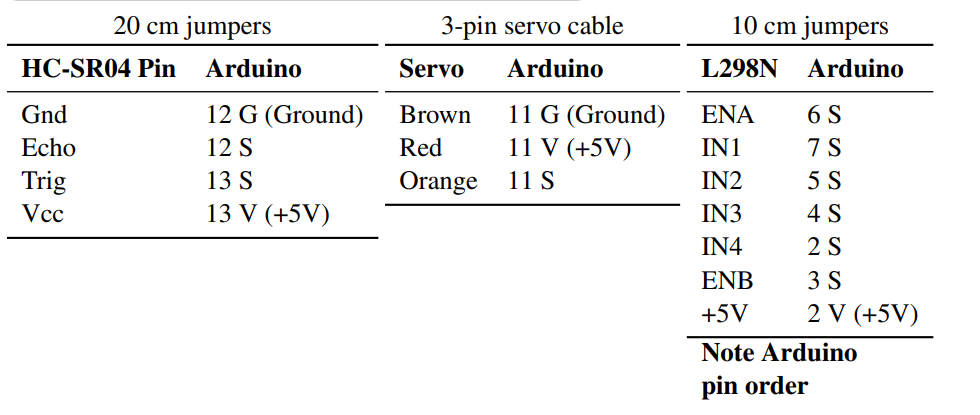

# Electrical Design
{: .fs-9 }

The electrical design of the robot.
{: .fs-6 .fw-300 }

---

## Parts

| No. | Name            |
|:---:|---              |
|1    |UNO R3 Board     |
|2    |Ultrasonic Sensor|
|3    |2x DC Motors     |
|4    |Servo            |
|5    |L298 Motor Driver|

## Schematic
The following is the schematic diagram:

The pinout definition is:

